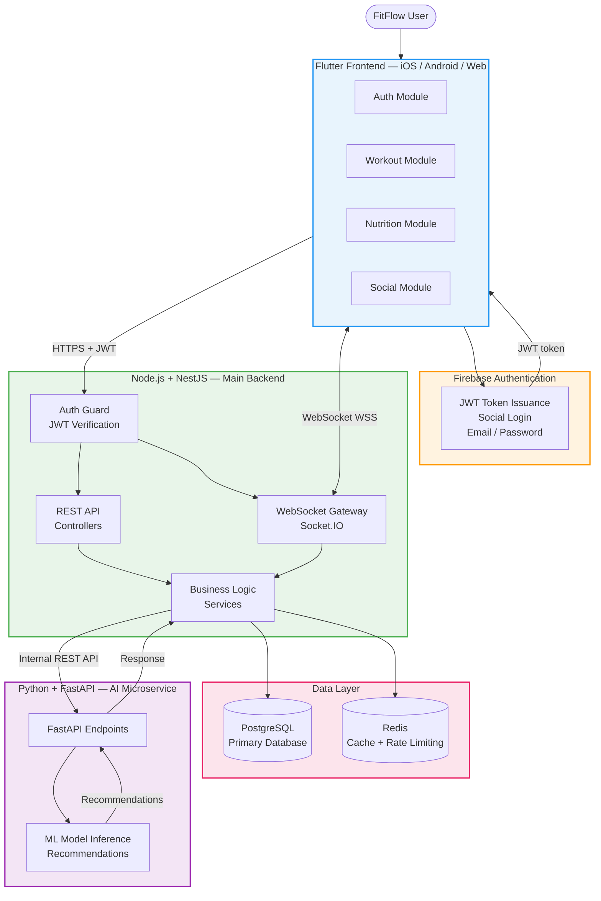

# FitFlow System Architecture

**IT3060 – Human Computer Interaction | Lab Exercise 05**

---

## Mermaid Architecture Diagram

The diagram below represents the high-level system architecture of FitFlow. It can be rendered by any Mermaid-compatible viewer (GitHub, VS Code Mermaid extension, mermaid.live).

---

## Component Descriptions

### Flutter Frontend (Blue)

The Flutter frontend is the user-facing application running on iOS, Android, and Web from a single Dart codebase. It is organized into feature modules:

- **Auth Module** — Handles Firebase Authentication flows (login, registration, social login, logout)
- **Workout Module** — Displays personalized workout plans, logs completed workouts
- **Nutrition Module** — Records meals, displays daily and weekly nutrition summaries
- **Social Module** — Social activity feed, workout posts, follow/unfollow

### Firebase Authentication (Orange)

Firebase Authentication is the managed authentication service. It issues signed JWT tokens after successful login. The Flutter client passes these tokens to NestJS on every API request.

### Node.js + NestJS Backend (Green)

The NestJS backend is the central application server. It handles:

- **Auth Guard** — Verifies every incoming JWT token using the Firebase Admin SDK
- **REST API Controllers** — Process HTTP requests for all data operations
- **WebSocket Gateway** — Manages real-time Socket.IO connections and event broadcasting
- **Business Logic Services** — Domain logic for workouts, nutrition, users, and social features

### Data Layer (Pink)

- **PostgreSQL** — Primary relational database storing all persistent application data (users, workouts, nutrition records, social posts, follows)
- **Redis** — In-memory store used for caching frequently accessed data, rate limiting counters, and WebSocket adapter coordination for horizontal scaling

### Python + FastAPI AI Microservice (Purple)

The dedicated AI service handles machine learning inference. It receives user data from NestJS and returns personalized recommendations (workout plans, nutrition insights, exercise suggestions). It is deployed and scaled independently from the main backend.

---

## Communication Summary

| Connection                    | Protocol              |
|-------------------------------|-----------------------|
| User → Flutter                | Direct (native app / browser) |
| Flutter → Firebase Auth       | HTTPS (Firebase SDK)  |
| Flutter → NestJS (REST)       | HTTPS                 |
| Flutter ↔ NestJS (real-time)  | WebSocket (WSS)       |
| NestJS → Firebase Auth        | HTTPS (Admin SDK)     |
| NestJS → PostgreSQL           | TCP (PostgreSQL protocol) |
| NestJS → Redis                | TCP (Redis protocol)  |
| NestJS → FastAPI AI           | HTTPS (internal REST) |

---

*Architecture file for IT3060 Lab Exercise 05 — FitFlow Redesign*
